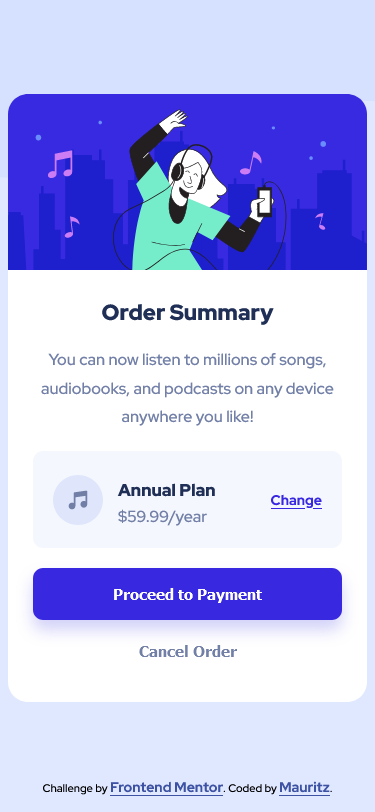
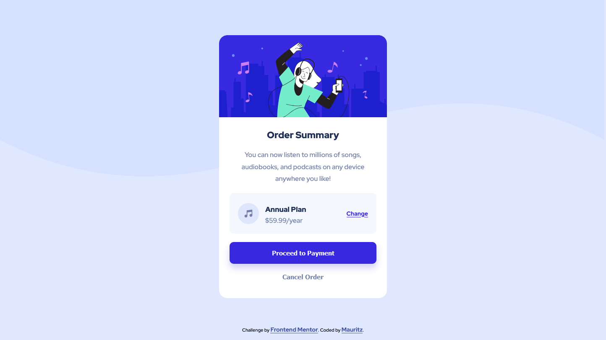

# Frontend Mentor - Order summary card solution

This is a solution to the [Order summary card challenge on Frontend Mentor](https://www.frontendmentor.io/challenges/order-summary-component-QlPmajDUj). Frontend Mentor challenges help you improve your coding skills by building realistic projects. 

## Table of contents

- [Overview](#overview)
  - [The challenge](#the-challenge)
  - [Screenshot](#screenshot)
  - [Links](#links)
- [My process](#my-process)
  - [Built with](#built-with)
  - [What I learned](#what-i-learned)
  - [Continued development](#continued-development)
  - [Useful resources](#useful-resources)
- [Author](#author)

**Note: Delete this note and update the table of contents based on what sections you keep.**

## Overview

### The challenge

Users should be able to:

- See hover states for interactive elements

### Screenshot




### Links

- Solution URL: [Add solution URL here](https://your-solution-url.com)
- Live Site URL: [Add live site URL here](https://your-live-site-url.com)

## My process

### Built with

- Semantic HTML5 markup
- CSS custom properties
- Flexbox
- Mobile-first workflow

### What I learned

1. I learned how to use a background image together with a background color to make a nice looking style.

```css
body {
    background-image: url("./images/pattern-background-mobile.svg");
    background-repeat: no-repeat;
    background-color: hsl(225, 100%, 94%);
}
```    

2. I am always learning something new about flexbox each time I use it. e.g. learned how to center a box using flexbox. The box being the order summary in this case.

```css
.body {
    display: flex;
    justify-content: center;
    align-items: center;
} 
```

### Continued development

Use this section to outline areas that you want to continue focusing on in future projects. These could be concepts you're still not completely comfortable with or techniques you found useful that you want to refine and perfect.

Some things that I want to focus on learning:

1. learn more about typography and making content pleasant to read. 
2. improve my layout skills with using flexbox and grid. 
3. I want to improve my use of units and learn about best practices.

### Useful resources

- [css-tricks flexbox article](https://css-tricks.com/snippets/css/a-guide-to-flexbox/) - I always refer to this article when using flexbox.
- [11 ways to center a div or text with css](https://blog.hubspot.com/website/center-div-css#:~:text=You%20can%20do%20this%20by,the%20div)%20vertically%20and%20horizontally.) - This showed me how to center a div using flexbox.
- [mdn guides](https://developer.mozilla.org/en-US/docs/Learn) - I use the mdn learning section if I get stuck or forget some of the basics.

## Author

- Frontend Mentor - [@yourusername](https://www.frontendmentor.io/profile/MauritzLM)
